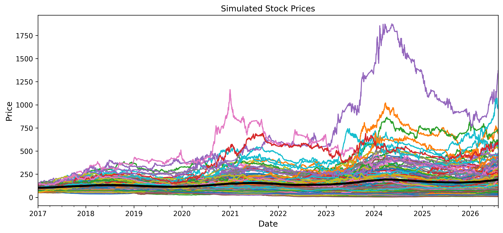

# Stock Market Prediction: Analyzing Trends and Forecasting Future Movements 
This repository contains data and information of the financial project in course TIF360/FYM360.

## Motivation
Predicting the stock market is a complex challenge that involves analyzing historical data to uncover patterns and trends that may offer insights into future movements. While some argue that market prediction is futile due to inherent uncertainties, advances in deep learning techniques offer potential strategies for gaining an edge.

This project explores predictive techniques to forecast future movements and make informed weighting decisions in a stock portfolio.

## Research Objective
Develop deep learning models capable of forecasting future trends in synthetic financial data and formulate asset allocation strategies optimized based on these predictions and/or with other methods.

## Dataset
This project includes multiple datasets for investigation, but you are free to explore and use your own data as well. As a general guideline, it is recommended to first explore deep learning techniques on the simulated data in Cases 1 and 2. Afterward, you can analyze portfolio strategies using the simulated stock data in Case 3, and later apply these techniques to real-world data in Case 4.

**Case 1:** Synthetic data of **20** geometric brownian motions (GBMs) of time series with **shared** drift and volatility parameter:

<p align="center">
  
</p>

**Case 2:** Synthetic data of **20** geometric brownian motions (GBMs) of time series with **independent** drift and volatility parameter but with **shared** seasonality:

<p align="center">
  
</p>

**Case 3:** A simulated portfolio of **180** stocks from different distributions with some shared characteristics, and some not:

<p align="center">
  
</p>

To investigate the correlation among stocks one can look at the corresponding correlation matrix (the order of the stocks are randomized):

<p align="center">
  
</p>

**Case 4:** Real data of some selected stocks (33), indexes (19), commodities (13) and bonds (8) are given. The assets are collected via *yahoo-finance* with the start date of **2010-01-04** and end date of **2025-03-31**, though some missing values still exist. For more information of these assets see the information files: [Stocks info](Real_data/stocks_info.txt), [Indexes info](Real_data/indexes_info.txt), [Commodities info](Real_data/commodities_info.txt) and [Bonds info](Real_data/bonds_info.txt)

## Portfolio simulations
To establish a baseline for different portfolio strategies, five example strategies are provided in the folder [Portfolio_examples](Portfolio_examples). These strategies are evaluated on the simulated stock data, where they are fitted on the first 500 days and tested over the subsequent 2000 days. The results of these portfolio strategies are visualized in the figure below:

<p align="center"> 
 
</p>

The table below highlights performance across different metrics. Green indicates the best performance for a given metric, while red marks the worst.

<p align="center"> 
 
</p>


## Installation
To run this project, ensure you have the following dependencies installed:
```bash
pip install numpy pandas matplotlib scipy
```


